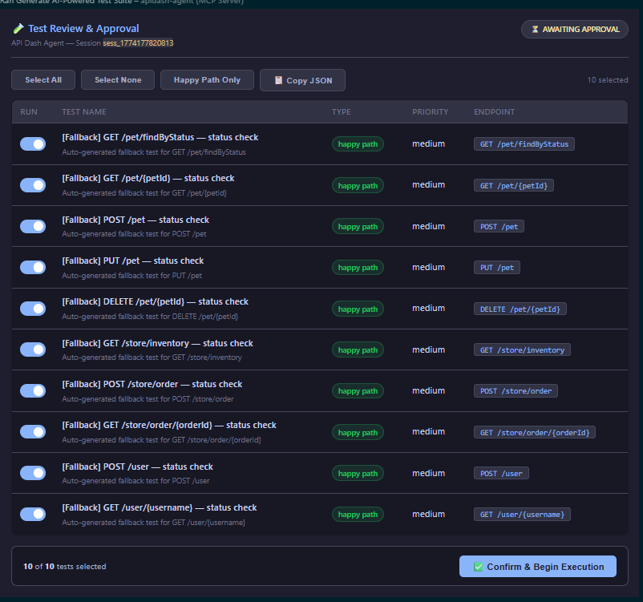

# apidash-agent-mcp

**GSoC 2026 POC — Agentic API Testing for API Dash**

A working MCP server demonstrating the full agentic pipeline: LLM test generation → human approval gate → live execution → schema drift detection → visual patch review — with two production-grade MCP Apps rendered natively inside the AI chat window.

🎬 **[Video Demo](https://www.youtube.com/watch?v=yynRa-KTfcY)**

---

## What This Demonstrates

| Stage | Tool / Component | Implementation |
|---|---|---|
| Spec ingestion | `parse_spec` | Hardcoded Petstore spec (OpenAPI 3.x in production) |
| AI test generation | `generate_tests` | Claude Haiku — happy path, boundary, error injection, security probes |
| Human approval gate | `test-review` MCP App | Interactive toggle table — user enables/disables tests before execution |
| Live execution | `execute_tests` | Real HTTP calls with per-assertion pass/fail evaluation |
| Drift detection + healing | `detect_and_heal` | Deterministic type diff + LLM-generated patch with confidence score |
| Patch review | `healing-diff` MCP App | Side-by-side diff — Approve/Reject via `ui/message` |
| Session inspection | `get_status` | Full pipeline state at any point |

---

## MCP Apps Protocol Compliance

Both MCP Apps implement the full [MCP Apps spec](https://modelcontextprotocol.github.io/ext-apps/) over a sandboxed iframe `postMessage` JSON-RPC bridge:

| Protocol Method | Where Used |
|---|---|
| `ui/initialize` + `hostContext` | Both apps — theme tokens applied via CSS variables on mount |
| `ui/notifications/initialized` | Both apps — sent after handshake |
| `ui/notifications/size-changed` | Both apps — `ResizeObserver` on every layout change |
| `ui/update-model-context` | `test-review` — pushes approved test IDs into agent context |
| `ui/message` | `healing-diff` — sends `PATCH_DECISION: approve/reject` back to agent |
| `ui/clipboard-write` | Both apps — copy JSON / copy diff |
| `_meta.ui.resourceUri` | `generate_tests`, `detect_and_heal` — links tool to MCP App |
| `text/html;profile=mcp-app` | Both resource registrations |

Shared utilities across all MCP Apps:
- `utils/rpc-client.ts` — `request()` / `notify()` postMessage bridge
- `utils/apply-host-context.ts` — applies host CSS variables to document root
- `utils/shared-styles.ts` — design token system (colors, spacing, typography, components)

---

## Key Design Decisions

**Prompt caching structure (Optimisation 9.1):** The spec context is the system prompt (stable cache prefix); the per-endpoint generation task is the user message (volatile). Cache-eligible on Anthropic Claude without any extra configuration.

**Model routing (Optimisation 9.2):** All LLM calls use Claude Haiku in this POC. In the full system, `security_probe` test generation and `BREAKING`/`ARCHITECTURAL` drift patches route to a larger model.

**Deterministic validation (Optimisation 9.3):** Every LLM output has its `id` rewritten to canonical form (`tc_001`, `tc_002`, …) and `enabled` normalised to `true` before entering the executor. The LLM cannot produce a test that silently skips execution.

**4-tier drift severity:** Schema drift is classified as `cosmetic → compatible → breaking → architectural` before any patch is generated. Severity determines whether human review is required and which model generates the patch reasoning.

---

## Prerequisites

- Node.js 18+
- VS Code Insiders (MCP Apps rendering support)
- Anthropic API key

---

## Local Setup

```bash
git clone https://github.com/hihry/MCP_APP_testing.git
cd MCP_APP_testing
npm install
npm run build
```

Set your API key:

```bash
# macOS/Linux
export ANTHROPIC_API_KEY=sk-ant-...

# Windows PowerShell
$env:ANTHROPIC_API_KEY="sk-ant-..."
```

### Running in VS Code Insiders

The server runs on `http://localhost:8000` via Streamable HTTP transport. Create `.vscode/mcp.json` in the repo root (already gitignored):

```json
{
  "servers": {
    "apidash-agent": {
      "type": "http",
      "url": "http://localhost:8000/mcp"
    }
  }
}
```

Start the server:

```bash
node dist/index.js
# → 🚀 MCP server running at http://0.0.0.0:8000
# → 📡 MCP endpoint: http://0.0.0.0:8000/mcp
```

Open VS Code Insiders → Copilot Chat → Agent mode. The five tools and two MCP Apps will be available immediately.

---

## Demo Flow

Run these prompts in order in VS Code Insiders Agent mode.

**Step 1 — Parse the spec**
```
parse the API spec
```
Session created, 4 endpoints parsed, state → `PLANNING`.

**Step 2 — Generate tests**
```
generate tests for the users endpoints
```
Claude Haiku generates 6–8 test cases. The **test-review MCP App** opens — an interactive toggle table where you enable/disable individual tests by type and click **Confirm & Begin Execution**.



Execution only starts after you confirm. Approved test IDs are pushed back into agent context via `ui/update-model-context`.

**Step 3 — Execute (clean run)**
```
execute the approved tests
```
Real HTTP calls to the Petstore API. Pass/fail per assertion, response times, status codes.

**Step 4 — Execute with drift simulation**
```
execute the tests with simulate_drift set to true
```
`GET /pet/{petId}` fails — the simulated v2 response returns `id` as `"usr_1"` (string) instead of `1` (integer). The `type_is: integer` assertion breaks.

**Step 5 — Detect drift and generate healing patch**
```
detect and heal the failures
```
Drift is classified as `BREAKING`. The **healing-diff MCP App** opens — side-by-side diff of the original assertion vs the proposed patch, with LLM reasoning and a confidence score.

**Step 6 — Approve the patch**

Click **Approve** in the healing-diff app. `PATCH_DECISION: approve` is sent back to the agent via `ui/message`.

---

## AgentCore Deployment

The server is deployed to Amazon Bedrock AgentCore Runtime via the AgentCore CLI. The `apidashMCPagent/` directory contains the full deployment configuration generated by `agentcore init`.

**Prerequisites:** AWS CLI configured, Node.js 20+, Docker, AWS CDK bootstrapped in your account/region.

**Deploy:**

```bash
cd apidashMCPagent
agentcore deploy --target default --yes
```

AgentCore Runtime expects the server to bind to `0.0.0.0:8000` and expose `POST /mcp` — the server is already configured this way.

**Auth:** The runtime uses a Cognito JWT authorizer (`CUSTOM_JWT`) with client credentials flow. Create a Cognito User Pool, resource server (`<identifier>/invoke` scope), and app client, then update `agentcore.json` with your pool's discovery URL, client ID, and scope before deploying.

**Connect from VS Code after deployment:**

```json
{
  "servers": {
    "apidash-agent-remote": {
      "type": "http",
      "url": "https://bedrock-agentcore.<region>.amazonaws.com/runtimes/<double-encoded-runtime-arn>/invocations",
      "headers": {
        "Authorization": "Bearer ${env:AGENTCORE_BEARER_TOKEN}"
      }
    }
  }
}
```

Note: the runtime ARN must be double-encoded (`%253A`, `%252F`) in the VS Code `mcp.json` URL.

---

## File Structure

```
src/
  index.ts              ← MCP server — 5 tools + 2 resource registrations
  types.ts              ← Pipeline TypeScript types
  constants.ts          ← Petstore spec + drift simulation data
  session-store.ts      ← In-memory session state machine
  services/
    llm-client.ts       ← Anthropic SDK — test generation + healing reasoning
    test-executor.ts    ← HTTP runner + assertion evaluator
    drift-detector.ts   ← Schema drift detection + patch generation
  ui/
    test-review.ts      ← test-review MCP App HTML
    healing-diff.ts     ← healing-diff MCP App HTML
  utils/
    rpc-client.ts       ← Shared postMessage JSON-RPC bridge
    apply-host-context.ts ← Host theme injection
    shared-styles.ts    ← Design token system

apidashMCPagent/
  agentcore/            ← AgentCore CLI project (agentcore.json, CDK stack)
  app/                  ← Application code isolated for AgentCore deployment

Dockerfile              ← Multi-stage build, PORT=8000, HOST=0.0.0.0
```

---

## Full System vs This POC

| Full System | This POC |
|---|---|
| SpecParser — OpenAPI 3.x / Postman / GraphQL | Hardcoded Petstore spec |
| Parallel Dart isolates for test execution | Sequential async/await |
| 5 MCP Apps (test-review, healing-diff, execution-monitor, report-viewer, message injection) | 2 MCP Apps (test-review, healing-diff) |
| Flutter WebView as MCP Apps host | VS Code Insiders |
| Episodic session memory across runs | In-memory Map |
| Full model routing — small/medium/large by task | All calls use Claude Haiku |
| Prompt caching across session lifetime | Single-session |

---

*GSoC 2026 — Agentic API Testing POC for API Dash*  
*Himanshu Ravindra Iwanati*
